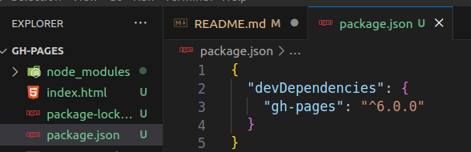
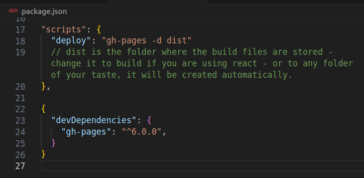

# gh-pages

[Doku (npm)](https://www.npmjs.com/package/gh-pages)

- ### add .gitignore file to local Repo, node_modules hinzufügen:

```bash
echo "node_modules/" >> .gitignore
# committen:
# git add .gitignore
# git commit -m "Add node_modules to .gitignore"
```

```bash
npm install gh-pages --save-dev
```

> installiert node_modules und package.json:



- ### package.json anpassen:

```json
"deploy": "gh-pages -d dist"
// oder statt "dist" Dein Ausgabeordner..
```

- #### so sollte package.json aussehen:



- ### Website veröffentlichen auf GH per Script im Terminal:

```bash
 npm run deploy
```
